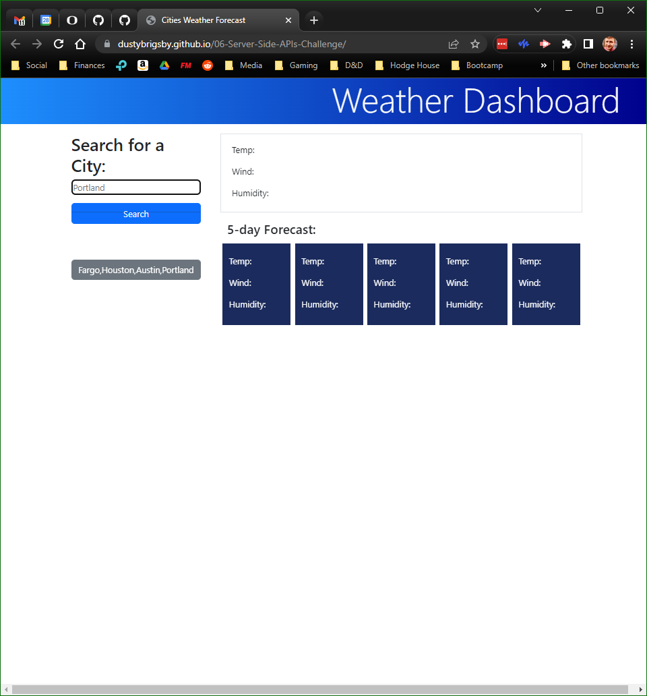

# Weather Dashboard

## Description

Displays the current weather as well as the 5-day forecast for the user entered city name.

## Installation

No installation requirements.

## Usage

Enter the name of a city into the search form and click the Search button to display the current weather and 5-day forecast for that city.

Cities searched for are displayed below the search form and can be clicked to re-search for that city's weather and forecast.

- [Deployed Application](https://dustybrigsby.github.io/06-Server-Side-APIs-Challenge/)

## Screenshot

## Credits

Extensively used the references and tutorials from:

- [MDN Web Docs](https://developer.mozilla.org/en-US/docs/Web/JavaScript)
- [W3 Schools](https://www.w3schools.com/jsref/default.asp)
- [Bootstrap](https://getbootstrap.com/docs/5.3/getting-started/introduction/)
- [Day.js](https://day.js.org/en/)
- [OpenWeather](https://openweathermap.org/api)

Referenced multiple activities from 06-Server-Side-APIs.

## License

MIT License
See LICENSE file in contatining directory
